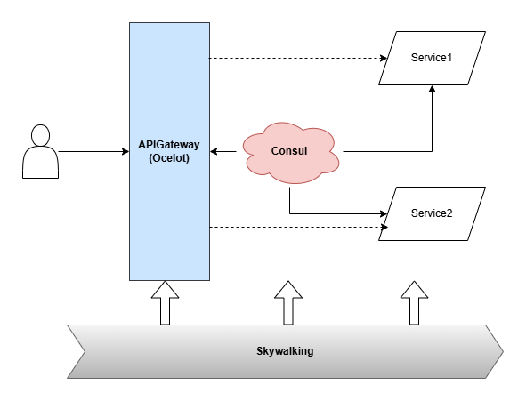
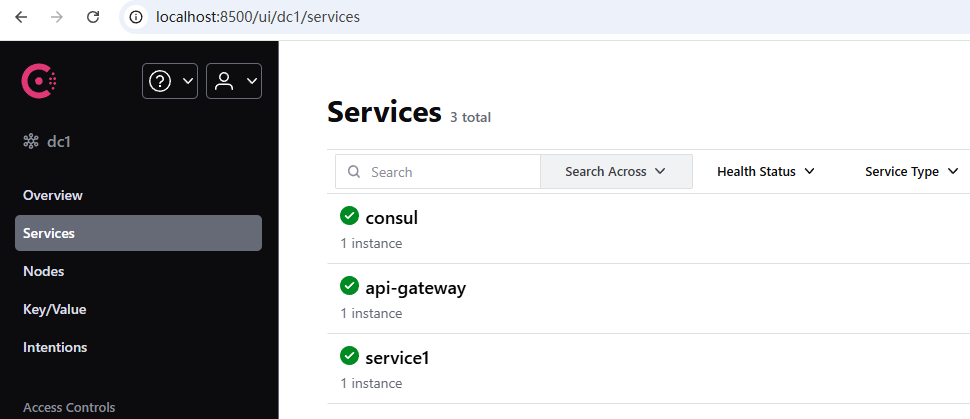
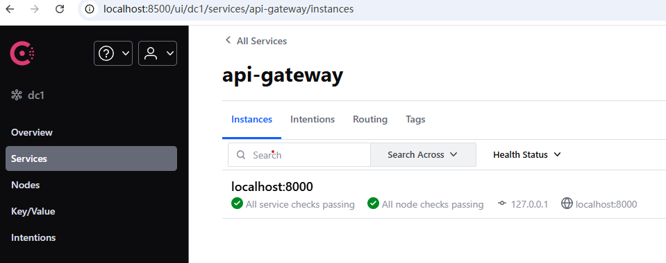
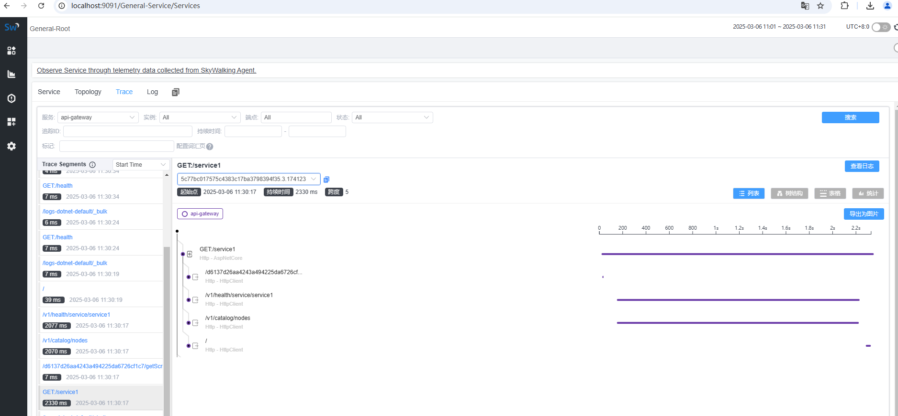

# APIGateWaySample
**Ocelot + Consul + Skywalking**
## 简介
系统设计图

### 网关
API网关（Gateway）是一个服务器，是系统的唯一入口。从面向对象设计的角度看，它与外观模式类似。API网关封装了系统内部架构，为每个客户端提供一个定制的API。它可能还具有其它职责，如身份验证、监控、负载均衡、缓存、限流等。

### 相关技术
##### 核心
- **Ocelot**：轻量级的.NET API网关
- **Consul**：服务发现和配置管理
- **Skywalking**：分布式系统的APM（应用性能监控）工具
##### 其它
- **Serilog**：日志。网关使用Serilog，将结构化的日志信息存储到ES(Elastic Search)，便于分析处理。
- **Elasticsearch**：是一个分布式、RESTful风格的搜索和分析引擎，具有以下特点：
  - 分布式实时文件存储，每个字段都被索引并可被搜索
  - 分布式实时分析搜索引擎
  - 可以扩展到上百台服务器，处理PB级结构化或非结构化数据
  - 在本项目中主要用于存储和分析系统日志数据
## 请求处理流程
- 用户请求API网关，网关根据Ocelot配置，处理和转发到下游服务（Service1,Service2...）。
- 各个服务注册到Consul，API网关通过服务发现的方式，向Consul请求下游服务的信息，从来实现转发。
- 网关等所有服务，集成到Skywalking，通过Skywalking监控应用的性能，包括调用链路，响应时间，异常等。
## 环境搭建
ES: 默认端口 9200
ES Head: 默认端口 9100
Skywalking: WEB默认端口 9091
Consul: 默认端口8500，设置好环境变量后，本地开发模式启动命令：consul agent -dev -node=127.0.0.1

## 运行效果图

## License

MIT License

Copyright (c) 2025

Permission is hereby granted, free of charge, to any person obtaining a copy
of this software and associated documentation files (the "Software"), to deal
in the Software without restriction, including without limitation the rights
to use, copy, modify, merge, publish, distribute, sublicense, and/or sell
copies of the Software, and to permit persons to whom the Software is
furnished to do so, subject to the following conditions:

The above copyright notice and this permission notice shall be included in all
copies or substantial portions of the Software.

THE SOFTWARE IS PROVIDED "AS IS", WITHOUT WARRANTY OF ANY KIND, EXPRESS OR
IMPLIED, INCLUDING BUT NOT LIMITED TO THE WARRANTIES OF MERCHANTABILITY,
FITNESS FOR A PARTICULAR PURPOSE AND NONINFRINGEMENT. IN NO EVENT SHALL THE
AUTHORS OR COPYRIGHT HOLDERS BE LIABLE FOR ANY CLAIM, DAMAGES OR OTHER
LIABILITY, WHETHER IN AN ACTION OF CONTRACT, TORT OR OTHERWISE, ARISING FROM,
OUT OF OR IN CONNECTION WITH THE SOFTWARE OR THE USE OR OTHER DEALINGS IN THE
SOFTWARE.